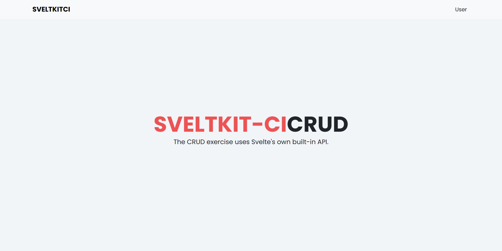

 
  

  &#xa0;

  <!-- <a href="https://sveltephp.netlify.app">Demo</a> -->

<h1 align="center">Sveltkit-Backend</h1>

  

  

  

  

  

  

  <a href="#dart-about">About</a> &#xa0; | &#xa0; 
  <a href="#rocket-technologies">Technologies</a> &#xa0; | &#xa0;
  <a href="#white_check_mark-requirements">Requirements</a> &#xa0; | &#xa0;
  <a href="#memo-license">License</a> &#xa0; | &#xa0;
  <a href="https://github.com/suryamsj" target="_blank">Author</a>

 

## :dart: About ##

Ini adalah REST API dari repo sveltkit-frontend.

## :rocket: Technologies ##

REST Api ini dibangun dengan menggunakan:

- [Codeigniter 3](https://codeigniter.com/)
- [RESTServer](https://github.com/chriskacerguis/codeigniter-restserver)
- [Mysql](https://www.mysql.com/)

## :white_check_mark: Requirements ##

Sebelum memulai :checkered_flag:, pastikan kamu sudah menginstall [Git](https://git-scm.com) dan [XAMPP](https://www.apachefriends.org/).

## :memo: License ##

Project ini memiiki lisensi MIT. Untuk informasi lebih detailnya, silahkan lihat file [LICENSE](LICENSE).

Dibuat dengan :heart: oleh <a href="https://github.com/suryamsj" target="_blank">Muhammad Surya J</a>

&#xa0;

<a href="#top">Back to top</a>
